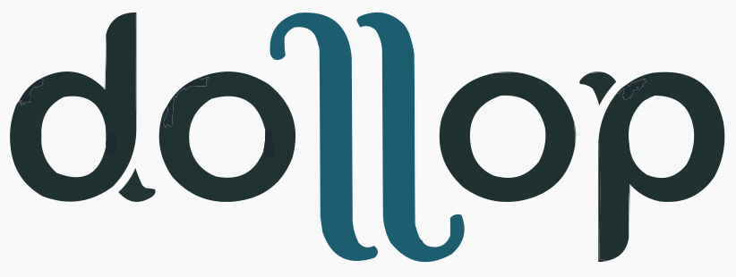

<picture>
  <source media="(prefers-color-scheme: dark)" srcset="internal/render/assets/dollop-dark.svg">
  
</picture>

_Share files and directories quickly and easily_

`dollop` is a command-line tool for sharing files and directories to unique,
expiring paths in a Cloudflare R2 bucket. Each upload gets its own prefix
derived from a random ID or name, and a public URL is printed when the upload
completes. Markdown is rendered to HTML on upload, with both files being
available.

Two upload modes:

- **Ephemeral** (default): objects are stored under `flash/<days>/<id>/` and
  deleted by R2 lifecycle rules after 1, 7, or 14 days.
- **Permanent**: objects are stored under `keep/<name>/` and are not subject to
  expiry.

Markdown rendering supports GitHub-flavoured markdown, with tables, alerts,
footnotes, mermaid diagrams and more supported.

## Installation

<details>
<summary><strong>Homebrew (macOS)</strong></summary>

```sh
brew install jamestelfer/tap/dollop
```

</details>

<details>
<summary><strong>mise</strong></summary>

[mise](https://mise.jdx.dev/) installs directly from GitHub Releases via the
[GitHub backend](https://mise.jdx.dev/dev-tools/backends/github.html):

```sh
mise use -g github:jamestelfer/dollop
```

</details>

<details>
<summary><strong>Nix</strong></summary>

```sh
nix profile install github:jamestelfer/dollop
```

</details>

<details>
<summary><strong>Install script</strong></summary>

Each release ships a self-contained installer (generated with
[binstaller](https://github.com/binary-install/binstaller)) that detects your
platform and checks the download against checksums embedded in the script — no
separate checksum file is fetched:

```sh
curl -fsSL https://github.com/jamestelfer/dollop/releases/latest/download/install.sh | sh
```

It installs to `~/.local/bin`; pass `-b` for another directory and a tag to pin
a version:

```sh
curl -fsSL https://github.com/jamestelfer/dollop/releases/latest/download/install.sh \
  | sh -s -- -b /usr/local/bin v1.9.1
```

The script carries a build-provenance attestation, so you can verify it before
running it (with an authenticated [GitHub CLI](https://cli.github.com/)). This
transitively covers the binary too: a verified script is guaranteed to hold the
genuine checksums it then enforces on the download.

```sh
curl -fsSL -O https://github.com/jamestelfer/dollop/releases/latest/download/install.sh
gh attestation verify install.sh --repo jamestelfer/dollop
sh install.sh
```

</details>

<details>
<summary><strong>Build from source</strong></summary>

```sh
just build        # produces dist/dollop
```

Add `dist/dollop` to your `$PATH`, or install wherever suits.

</details>

## Configuration

dollop reads a YAML config file at `$XDG_CONFIG_HOME/dollop/config.yaml`
(defaults to `~/.config/dollop/config.yaml`). R2 credentials are kept in the OS
keyring, not the config file.

Set config values:

```
dollop config set bucket      <bucket-name>
dollop config set account-id  <cloudflare-account-id>
dollop config set base-url    <public-base-url>
```

Store R2 credentials in the keyring:

```
dollop config auth r2-key     <access-key-id>
dollop config auth r2-secret  <secret-access-key>
```

Review current config (credentials are not shown):

```
dollop config list
dollop config get base-url
```

## Usage

```
dollop create <path>              # ephemeral, expires in 1 day
dollop create --days 7  <path>   # ephemeral, expires in 7 days
dollop create --days 14 <path>   # ephemeral, expires in 14 days
dollop create --keep    <path>   # permanent (mutually exclusive with --days)
```

`<path>` can be a single file or a directory. Directories are walked
recursively; the key structure mirrors the source tree under the generated
prefix.

On success, dollop prints the public URL of the upload:

```
https://cdn.example.com/flash/7/v8p2xkqj3m/
```

### Mermaid diagrams

Markdown containing ` ```mermaid ` fenced code blocks renders as diagrams in the
browser. Rather than embedding the ~3 MB mermaid engine in every upload, dollop
publishes it once to a shared, version-pinned location in the bucket
(`deps/mermaid/<version>/`) and every rendered page references it by relative
path. Pages load it as an ES module, so only the diagram types a page actually
uses are fetched.

Publish the engine once — and again whenever a new dollop release bumps the
pinned mermaid version:

```
dollop deps publish          # fetch, verify, and upload the pinned engine
dollop deps publish --force  # re-upload even if already present
dollop deps status           # show the shipped version and whether it is published
```

`dollop doctor` reports the same presence check. If you publish markdown with a
mermaid diagram before running `deps publish`, dollop prints a warning and the
diagram will not render until the engine is published.

## Cloudflare R2 setup

### Bucket

A single R2 bucket is required. The bucket name is stored in the `bucket` config
key, and the Cloudflare account ID in `account-id`.

### Public access

The bucket must have public read access enabled, either via its R2.dev subdomain
or a custom domain. The resulting base URL (e.g. `https://pub-abc123.r2.dev` or
`https://cdn.example.com`) is the `base-url` config value.

### API credentials

An R2 API token with **Object Read & Write** permission scoped to the bucket
produces an Access Key ID and Secret Access Key. These are the `r2-key` and
`r2-secret` keyring values respectively.

### Lifecycle rules

Ephemeral uploads are expired by R2 object lifecycle rules. Three rules are
required, one per supported expiry period:

| Prefix filter | Expiration |
| ------------- | ---------- |
| `flash/1/`    | 1 day      |
| `flash/7/`    | 7 days     |
| `flash/14/`   | 14 days    |

Objects under `keep/` are not covered by any lifecycle rule and are retained
indefinitely.
